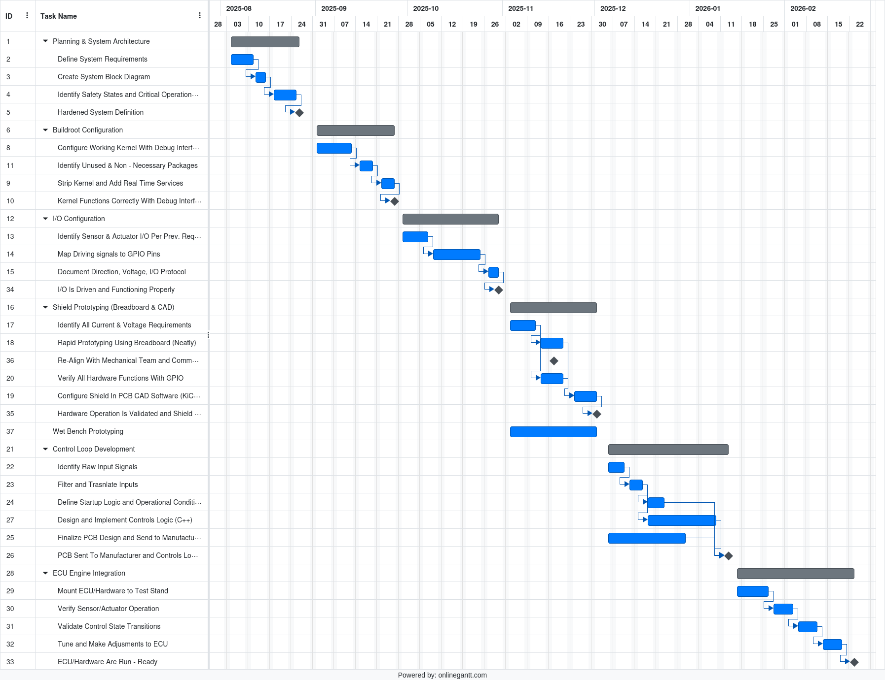
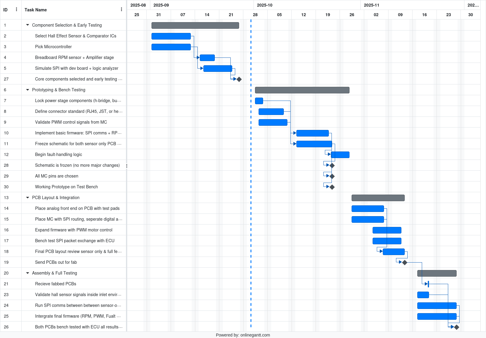

# jet_engine_ecu
Collaboration space for WNE jet engine ECU

## Execution Plans
These are the execution plans being followed to perform the jet engine control systems task

### ECU Execution Plan

### Inlet PCB Execution Plan

